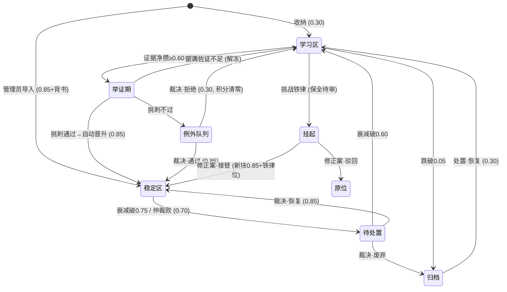

# BetterRAG 生命周期引擎规格（v4）

> 配套：[CONTEXT.md](../CONTEXT.md)（术语表）· [docs/adr/](./adr/)（决策记录，新增 [ADR-0005](./adr/0005-证据不对称与自证晋升.md)）· [demo演示脚本.md](./demo演示脚本.md)（十镜三幕）
> **v4 设计宪法**：简单（易懂）、高效、稳定、有效、创新——任何机制过「机制五问」（§1）方可进核心。v4 把 v3 的机制堆叠收敛为极简内核：**一个变量、两种信号、三条规则、一张图**。全部参数进 `config` 可调。

---

## 0. 定位

黑客松垂直切片：运营商资费域，15 篇材料，架构完全域无关（换语料 30 秒迁移）。核心承诺不变：系统只有一个状态变量（置信度），三级分区是它的区间投影，全生命周期是带审计的置信度事件（ADR-0001）。

## 1. 机制五问（设计宪法）

| 问 | 要素 | 检验 |
|---|---|---|
| 一句话能对非工程师讲清吗？ | 简单·易懂 | 用户可预测系统行为 |
| 成本声明了吗？ | 高效 | LLM 调用数 + 每周人时 |
| 坏了有退路吗？ | 稳定 | 核心层永不因它瘫痪 |
| 有一个可测指标 + 30 秒能演示吗？ | 有效 | 演不出＝不存在 |
| 差异一句话说得清吗？ | 创新 | 区别在原则不在参数 |

判定：五问全过 → **核心**；缺退路 → **探索层**（须附核心退路，见 §14）；讲不清 → **灵感存档**（见[产品路线图 v2](./产品路线图.md)）。

## 2. 一个变量

### 2.1 两分量

| 分量 | 驱动 | 定义 |
|---|---|---|
| `conf_stored` | 事件 | 只被证据与人工事件改变 |
| `freshness` | 时间 | `0.5^(max(0, 闲置天数−14)/分区半衰期)`；闲置天数＝距上次**采纳** |

**有效置信度 = conf_stored × freshness**——分区投影与检索权重的唯一取值（ADR-0001）。

### 2.2 分区投影

学习区 [0.05, 0.60) ｜ 预备区（举证期居所）[0.60, 0.75) ｜ 稳定区 [0.75, 1.00]（可挂铁律位）。归档态与挂起态不参与投影、不可检索。**无 zone 列**——分区是读时投影。

### 2.3 两条铁则

- **棘轮**：物化降级时 `conf_stored` 下调至当时有效值（掉的分须重新挣得），截断 0.749；**物化同时重锚衰减基线**（衰减时钟自物化时刻重新起算，防双计），宽限期不重复适用。
- **机器写入边界**：常规自动事件上限 0.749；**AUTO_PROMOTE 是唯一有权跨越稳定区下界的机器事件**（举证期挑刺通过后置 0.85，事件附案卷，ADR-0005）。

## 3. 两种信号

### 3.1 分桶（五类归三桶）

| 桶 | 信号 | 结算 |
|---|---|---|
| **活性** | 采纳（答案实际使用了该块） | 重置保鲜时钟，**零积分** |
| **证据·正** | 落地型追问 / 工单一次闭环 / 👍（弱） | +0.02 |
| **证据·负** | 同题重问 / 转人工 / 👎 | −0.02 / −0.03 / −0.04 |
| **无证据** | 沉默（满意？放弃？离开？不可分） | **0** |

证据流向所有未归档块：稳定区靠正证据攀升 tenure（闲置容忍 80→165 天）；铁律照记负证据（记账零豁免，§4.3）。

### 3.2 判定的零成本实现

全部事件化/规则化，**零 LLM 调用**：转人工＝会话事件；重问＝相邻消息相似度阈值（embedding 已有）；工单闭环＝工单系统回调；👍/👎＝按钮。

### 3.3 LLM 经济学

作答 1 + 冲突判定 1（仅冲突时）+ 挑刺 1（仅晋升时）+ 归纳摘要 1/材料 + 传记 1（展示时按需）。信号、星图、仪表盘＝0。

### 3.4 人时经济学

用户零新增动作（证据全是被动结局）。管理员只裁例外与红灯，目标 **<30 分钟/周**。

## 4. 三条规则

### 4.1 慢升（自证晋升）

证据净攒跨 0.60 → **举证期**（冻结 7 虚拟天，不衰减）→ **一次 AI 挑刺**（judge 一并检验：与铁律及近邻稳定块是否矛盾？独立佐证是否 ≥3 源？反方质询有无红旗？→ 输出一个过/不过判定）：

- 挑刺通过 → **AUTO_PROMOTE 置 0.85**，事件附案卷（结局统计、佐证来源、质询记录）；
- 挑刺不过 → **例外队列**，人工裁决（通过 0.85 / 拒绝 0.30 且积分清零 / 修改后通过）；
- 观察窗满而佐证不足 → 解冻回学习区（积分保留，衰减恢复）。

政策拨盘 `promotion.policy = auto | gated`：合规域可切回人工门（默认 auto）。

### 4.2 快降

负证据 + 保鲜衰减；跌破 0.75 自动降预备·待处置（棘轮落 0.749），跌破 0.60 滑回学习区，跌破 0.05 归档（约 232 天证明窗口 + 14 天宽限）。人工处置（打回 0.70 / 整篇重审 / 恢复 0.30）随时可用但非必需。降级报告 + 审计链全程。

### 4.3 铁律特例（记账零豁免）

- 保留：不自动降级、冲突必胜、只能由管理员设置。
- **红灯通道（修订）**：挑战铁律不再处决挑战者——共现冲突且防守方带铁律位时：**挑战者保护性挂起**（不扣分、不衰减、不可检索，标记修正案候选）+ **铁律异议 +1**。
- **红灯**：异议 ≥3，或铁律自身负证据窗口异常（30 天内 ≥3 笔）→ 仪表盘置顶横幅 + 催办。
- **修正案**：新旧并排 + 证据陈列 → **一键接替**（新块 0.85+铁律位，旧铁律归档+取代链，原子事件）或**驳回**（挑战者解除挂起回原状态）。
- 修正前旧铁律继续作答——旧政策在废止前仍有效，这是合规正确性。

## 5. 状态机



## 6. 事件表（append-only 审计链）

| 事件 | 触发者 | 效果 |
|---|---|---|
| INGEST 收纳 | Agent | =0.30；生成归纳摘要 |
| ADMIN_IMPORT | 管理员 | =0.85；背书 |
| ADOPT 采纳 | 用户（间接） | 活性：重置保鲜，零积分 |
| EVID_POS 正证据 | 用户（被动） | +0.02（落地/闭环/👍） |
| EVID_NEG 负证据 | 用户（被动） | −0.02/−0.03/−0.04 |
| RECONCILE 衰减物化 | 协调任务 | 棘轮+重锚，跨界迁移 |
| PROBATION_ENTER | 引擎 | 举证期开始（冻结） |
| VET_PASS 挑刺通过 | AI | AUTO_PROMOTE 0.85（附案卷） |
| VET_FLAG 挑刺不过 | AI | → 例外队列 |
| PROBATION_EXPIRE | 引擎 | 解冻回学习区 |
| ADJUDICATE_PASS / REJECT / EDIT | 管理员 | 例外裁决：0.85 / 0.30 清零 / 新块 0.85 旧块归档 |
| ADJUDICATE_RESTORE / DEMOTE / ARCHIVE | 管理员 | 待处置裁决 |
| KICKBACK / FULL_REVIEW | 管理员 | 置 0.70 待处置 |
| CONFLICT_INC | 检测器 | 非铁律防守方计数 +1（N=3 触发阶梯） |
| SUSPEND 挂起 | 检测器 | 铁律挑战者保全（不扣分不衰减） |
| IRON_DISSENT | 检测器 | 铁律异议 +1 |
| IRON_ALERT 红灯 | 引擎 | 异议/负证据异常达阈值，置顶催办 |
| AMEND_REPLACE 接替 | 管理员 | 原子：新块 0.85+铁律位，旧铁律归档+取代链 |
| AMEND_REJECT 驳回 | 管理员 | 挑战者解除挂起回原位 |
| ARB_WIN_NEW / OLD / NOVOTE | 点选 | 防守方置 0.70 / 挑战者 +0.10（上限 0.749）/ 计数 −1 |
| RESTORE / TIER0_SET·UNSET | 管理员 | 归档恢复 0.30 / 铁律位 |

## 7. 参数表（config 全量可调）

| 键 | 默认值 | 语义 |
|---|---|---|
| conf.initial | 0.30 | 收纳入学习区 |
| conf.zone.prelim_min / stable_min | 0.60 / 0.75 | 分区界 |
| conf.archive_line | 0.05 | 废弃线（约 232 天+14 宽限） |
| conf.promote_value | 0.85 | 晋升/导入/恢复置入值 |
| conf.machine_cap | 0.749 | 常规自动事件上限 |
| conf.stable_climb_max | 1.00 | 稳定区内攀升上限 |
| conf.demote_value | 0.70 | 打回/仲裁败落点 |
| score.evid_pos | +0.02 | 正证据（落地/闭环/👍） |
| score.reask / escalate / dislike | −0.02 / −0.03 / −0.04 | 负证据 |
| signal.reask_sim_threshold | 0.85 | 重问判定相似度 |
| decay.half_life.learn / stable | 90 / 365 天 | 半衰期 |
| decay.grace_days | 14 | 闲置宽限 |
| promotion.probation_days | 7 | 举证期窗口 |
| promotion.policy | auto | auto \| gated（合规拨盘） |
| promotion.vet_sources_min | 3 | 挑刺佐证下限 |
| conflict.threshold_n | 3 | 冲突触发仲裁 |
| conflict.hedge_gap | 0.25 | 对冲判负差 |
| iron.dissent_threshold | 3 | 红灯（异议） |
| iron.anomaly_threshold | 3 笔/30 天 | 红灯（负证据异常） |
| retrieve.top_k_blocks | 8 | 召回块数 |
| retrieve.exploration_seats | 1–2 | 探索席（相关性 ≥0.75×最高分） |
| retrieve.neighbor_window | ±1 | 相邻块窗口 |
| ingest.scan_interval / chunk | 60 秒 / 400 字/50 重叠 | 收纳 |

## 8. 检索管线（单通道）

1. 问题 → embedding；
2. 全库块检索：`score = cosine × 有效置信度`，归档/挂起排除；
3. **探索召回**：top-k 内高相关低置信块保 1–2 席，答案标「含探索性召回」；
4. 上下文拼装：命中块 + 同材料相邻块（±1），每块带分区标注（治理单元=知识块、召回单元=材料）；
5. 生成：标注实际采纳块；**来源透明**：学习区块强制渲染标注；
6. 后置：采纳记 ADOPT（活性）；👍/👎 记证据；
7. **冲突检测**：采纳集跨分区共现 + LLM judge 判竞争 → 防守方带铁律位：SUSPEND 挑战者 + IRON_DISSENT；否则防守方计数 +1（N=3 入仲裁阶梯：铁律位走红灯 → 差 ≥0.25 对冲 → 影子双答点选）。

## 9. 收纳管线

扫描工作区（60 秒/mtime diff）→ 归纳摘要（1 次 LLM）→ **原文切片**（照搬原则，ADR-0003）→ embedding → 0.30 入库。

## 10. 存储（SQLite 单文件）

```sql
materials(id, title, source_path, summary, summary_version, imported_by_admin, created_at)
blocks(id, material_id, chunk_index, content, embedding, conf_stored, decay_baseline_at,
       last_engagement_at, frozen, pending_reason, suspended, archived, tier0,
       iron_dissent, adopted_count, created_at)
events(id, ts, block_id, material_id, type, actor, delta, confidence_after, note)
citations(id, ts, block_id, question, adopted, outcome)
conflicts(id, defender, challenger, count, status, verdict)
llm_providers(id, name, base_url, api_key, models, ctx_window, max_output, multimodal, ok)
config(key, value)
```

## 11. 虚拟时钟（ADR-0004）

读注入 `clock.now()`；衰减读时计算；快进 = jump + 预演事件重放（被使用的块保鲜、无人问津的衰减）+ 协调任务幂等物化；事件时间戳走虚拟时钟。

## 12. 引擎接入

OpenAI-compatible；配置：请求地址/密钥/模型列表/上下文窗口/输出上限/多模态位/测试连通按钮；角色映射（作答/摘要/挑刺/判定）；demo 单供应商。

## 13. API 与页面

| 端点 | 用途 |
|---|---|
| POST /api/ask | 问答（答案+引用+分区标注+探索标注） |
| POST /api/feedback | 证据（👍/👎 归因采纳块） |
| POST /api/scan | 立即扫描工作区 |
| GET /api/exceptions | 例外队列（含挑刺案卷） |
| POST /api/adjudicate/{action} | pass / reject / edit / restore / demote / archive |
| POST /api/admin/{op} | kickback / full_review / tier0 / restore / import |
| GET /api/alerts | 红灯状态 |
| POST /api/amend/{action} | 修正案：replace / reject |
| POST /api/conflict/{id}/vote | 影子双答点选 |
| POST /api/clock/jump | 快进（jump+重放） |
| GET /api/dashboard · /api/starmap | 仪表盘 / 星图（分区着色+冲突连线+时间滑块） |
| GET/POST /api/providers | 引擎接入配置+测试连通 |

**三页面**：问答页、**例外裁决台**（队列+案卷+反方质询）、仪表盘（星图+分区分布+红灯横幅+事件流+⏩快进）。

## 14. demo 简化 vs 产品真相（含探索层退路）

| 决策点 | demo | 产品真相 |
|---|---|---|
| 计分时机 | 重放脚本带结局标签；现场问答仅记活性 | 结局结算制（接入工单回调即真实化） |
| 晋升政策 | auto（自证晋升） | + gated 拨盘、预定接替（探索层） |
| 影子生成 | 缓存制（分镜预热） | 运行时双生成（探索层：统计版陪审在存档） |
| 信号 | 👍 代工单闭环 | 工单回调 / 转人工事件 / 重问判定 |
| 材料 | Markdown | PDF/多模态（存档） |
| 元健康 | 传记卡片 | 晋升存活率全套指标 |

**探索层（demo 不建，每项附核心退路）**：影子降级（退路：阈值降级）· 矛盾巡检（退路：行为级检测）· 落地追问判定（退路：规则化信号）· 预定接替（退路：手动修正案）· 缺口空间探测（退路：无，纯增益）。详见[产品路线图 v2](./产品路线图.md)。

## 15. 非目标

爬虫、多租户、图数据库、权限体系、真实流量 A/B、分钟级真实时钟、多模态解析、供应商 fallback 链。

## 16. 目录结构

```
src/engine/  clock.py · confidence.py · reconcile.py · ingest.py
             retrieve.py · promote.py(举证期/挑刺/自证晋升) · arbitrate.py · llm.py
src/api/     FastAPI 端点
src/web/     问答页 · 例外裁决台 · 仪表盘+星图
data/        betterrag.db · workspace/ · corpus/
tests/       虚拟时钟单测（状态机迁移/棘轮重锚/红灯阈值）
```
